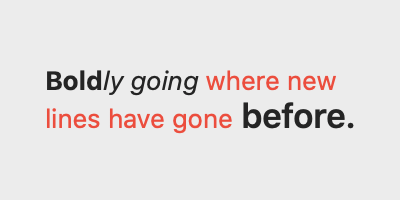
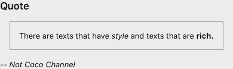

# Rich Text in SwiftUI

This repository demonstrates the simple technique for rendering rich text, like
NSAttributedString, in native SwiftUI.

## TLDR

```swift
Text("This is ") + Text("bold").bold() + Text(" text.")
```

Renders to: "This is **bold** text."

## Details

Prior to SwiftUI, the main way to render rich text (ie styled and formatted text like
markdown output) was to use NSAttributedString. SwiftUI didn't launch with support
for NSAttributedString, and all the examples I've seen only ever use block-level
text styles.

However, SwiftUI _does_ directly support rich text with a little known (at least
to me) feature of the `Text` view:

```swift
extension Text {

    /// Concatenates the text in two text views in a new text view.
    ///
    /// - Returns: A new text view containing the combined contents of the two
    ///   input text views.
    public static func + (lhs: Text, rhs: Text) -> Text
}
```

Since styling functions like `Text.bold()` return a `Text`, you can concatenate
styled `Text` views together and SwiftUI will render them with an inline layout.

New with macOS 11 is the ability to inline `Image` elements as well:

```swift
extension Text {

    /// Creates an instance that wraps an `Image`, suitable for concatenating
    /// with other `Text`
    @available(iOS 14.0, OSX 10.16, tvOS 14.0, watchOS 7.0, *)
    public init(_ image: Image)
}
```

## Basic Example

All code examples are in this repository and runnable in XCode 12 on Catalina.
This idea works in XCode 11 if you revert some Swift 5.3-isms.

```swift
struct BasicRichTextView: View {
    var body: some View {
        (
            Text("Bold").bold() +
            Text("ly going").italic() +
            Text(" where new lines have gone").foregroundColor(.red) +
            Text(" before.").font(.headline)
        )
        .padding()
        .frame(maxWidth: 200, maxHeight: 100)
    }
}
```



## Programmatic Example

With that simple primitive we can build up a renderer for a simple HTML-like or Markdown-like
internal text representation. In this example, blocks of rich text are stacked vertically and
are completely under our control, while inline text elements inside the blocks are built with
`Text` concatenation.

We'll just support 2 types of blocks and a few simple text styles to keep things simple. Here
is our internal representation:

```swift
enum RichTextBlock: Hashable {
    case plainTextBlock([InlineText])
    case quote([RichTextBlock])
}

struct InlineText: Hashable {
    let text: String
    let attributes: TextAttributes
}

struct TextAttributes: OptionSet, Hashable {
    let rawValue: Int

    static let bold    = TextAttributes(rawValue: 1 << 0)
    static let italic  = TextAttributes(rawValue: 1 << 1)
    static let heading = TextAttributes(rawValue: 1 << 2)
}
```

`plainTextBlock` will be like an html `<p>`, and `quote` will be like `<quote>`. Instead
of tracking style spans on the inline text, we just enumerate all the styles that apply
to a particular chunk of text.


The bones of the core view are a switch statement over our model that delegates to renderers
for each block type:

```swift
struct TextBlockView: View {
    let block: RichTextBlock
    
    var body: some View {
        VStack {
            switch block {
            case .plainTextBlock(let text):
                renderInlineText(text)
            case .quote(let quote):
                renderQuote(quote)
            }
        }
    }
    
    func renderInlineText(_ text: [InlineText]) -> some View { ... }

    func renderQuote(_ quote: [RichTextBlock]) -> some View { ... }
}
```

The inline text renderer uses the concatenation technique:

```swift
    func renderInlineText(_ text: [InlineText]) -> some View {
        return text.map {t in
            var atomView: Text = Text(t.text)
            if t.attributes.contains(.bold) {
                atomView = atomView.bold()
            }
            if t.attributes.contains(.italic) {
                atomView = atomView.italic()
            }
            if t.attributes.contains(.heading) {
                atomView = atomView.font(.headline)
            }
            return atomView
        }.reduce(Text(""), +)
    }
```

The quote renderer is just a vstack with a border. It recursively calls TextBlockView
showing we have the the flexibility to arbitrarily embed text blocks inside other blocks:

```swift
    func renderQuote(_ quote: [RichTextBlock]) -> some View {
        return VStack {
            ForEach(quote, id: \.self) {q in
                TextBlockView(block: q)
            }
        }
        .padding()
        .border(Color.gray, width: 1)
        .padding()
    }
```

That's it! Here's some demo IR (it's ugly no need to read it carefully):

```swift
let demoBlocks: [RichTextBlock] = [
    .plainTextBlock([
        InlineText(text: "Quote", attributes: [.heading]),
    ]),
    .quote([
        .plainTextBlock([
            InlineText(text: "There are texts that have ", attributes: []),
            InlineText(text: "style", attributes: [.italic]),
            InlineText(text: " and texts that are ", attributes: []),
            InlineText(text: "rich.", attributes: [.bold]),
        ])
    ]),
    .plainTextBlock([
        InlineText(text: "-- Not Coco Channel", attributes: [.italic]),
    ])
]
```

Rendered:



## Problems

Clickable links don't seem to be supportable. While you can attach `onTapGesture`
to `Text`, it returns a generic `View`, so you can no longer concatenate the
result.

## Unexplored

* How does performance compare with NSAttributedString text views under AppKit?
* Is it possible for user code to create custom inlineable Text elements, for example to add
widgets like buttons inline into text?
* Simulating links with hacks or workarounds.

## Alternative: Wrapping NSAttributedString Views

[This](https://stackoverflow.com/a/59891267/630966) stack overflow answer shows how to render
an `NSAttributedString` via an `NS/UITextView` wrapped in a `UIViewRepresentable`. In my
experience it partly works. There are two problems with this technique.

First, it relies on adapters to AppKit or UIKit. How much this is a problem is going to vary
from person to person.

Second, since layout is recalculated asynchronously the bottom edge of the adapter view has
ugly lag during horizontal resizes that cause vertical reflow.
